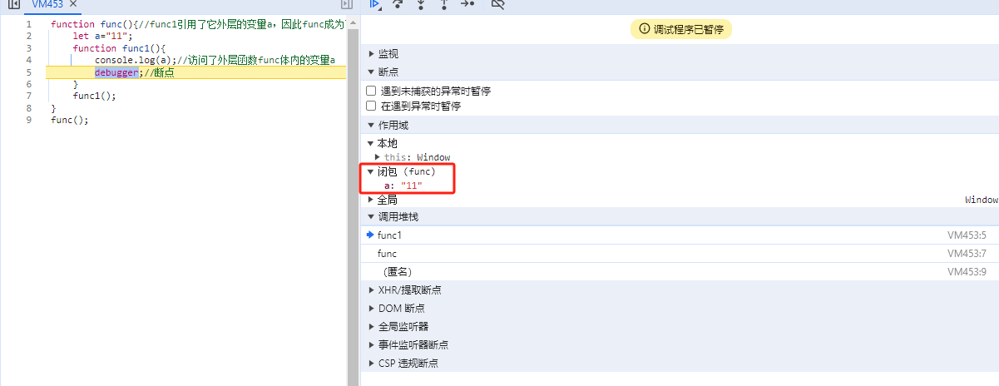

---  
date: 2024-03-06  
series: javascript  
tags:  
  - 面试  
  - javascript  
title: Javascript的闭包  
slug: js-closure  
keywords: javascript闭包  
description: 面试,javascript,闭包,closuer  
lastmod: 2024-03-07  
share: true  
---  
  
### 什么是闭包  
**闭包** 是指一个函数可以记住其外部变量并可以访问这些变量。  
```javascript  
function func(){//func1引用了它外层的变量a，因此func成为了闭包  
    let a="11";  
    function func1(){  
        console.log(a);//访问了外层函数func体内的变量a  
        debugger;//断点  
    }  
    func1();  
}  
func();  
```  
  
  
### 为什么Javascript中所有的函数都是闭包  
当访问一个变量时，首先会搜索内部的词法环境，然后搜索外部环境，以此类推，直到全局词法作用域。  
如果在任何地方都找不到这个变量，那么在严格模式下就会报错（在非严格模式下，为了向下兼容，给未定义的变量赋值会创建一个全局变量）。  
关于词法作用域[Lexical Environment](https://zh.javascript.info/closure#ci-fa-huan-jing)  
JavaScript 中的函数会自动通过隐藏的 `[[Environment]]` 属性记住创建它们的位置，所以它们都可以访问外部变量。  
  
### 经典小例子  
```javascript  
for (var i = 1; i <= 5; i++) {  
   setTimeout(function test() {  
        console.log(i) //>> 6 6 6 6 6  
    }, i * 1000);  
}  
```  
本意是想每隔一秒输出“1 2 3 4 5”，但是却输出了“6 6 6 6 6 ”。原因是根据作用域链变量的查找机制，setTimeout回调函数的`i`会引用全局变量的`i`,当for循环完毕后，`i`的值为6，所以输出“6 6 6 6 6”。  
下面是利用IIFE函数实现闭包，达成输出理想结果的例子：  
```javascript  
for (var i = 1; i <= 5; i++) {  
  (function(j) {//包了一层IIFE形式的函数，这个函数是闭包  
    setTimeout(function test() {//函数体内的j引用了外层匿名函数的参数j  
      console.log(j); //>> 1 2 3 4 5  
    }, j * 1000);  
  })(i);  
}  
```  
下面让我们用上面示例理解闭包的形成：  
- 闭包肯定是一个函数  
- 内层的函数需要引用上层作用域里的变量/参数，如上面的IIFE函数里的变量`j`引用上层作用域的`j`，也就是for循环里的`i`  
  
### 闭包的优缺点  
- **优点**可以存储私有变量  
- **缺点**闭包常驻与内存，容易造成内存泄漏