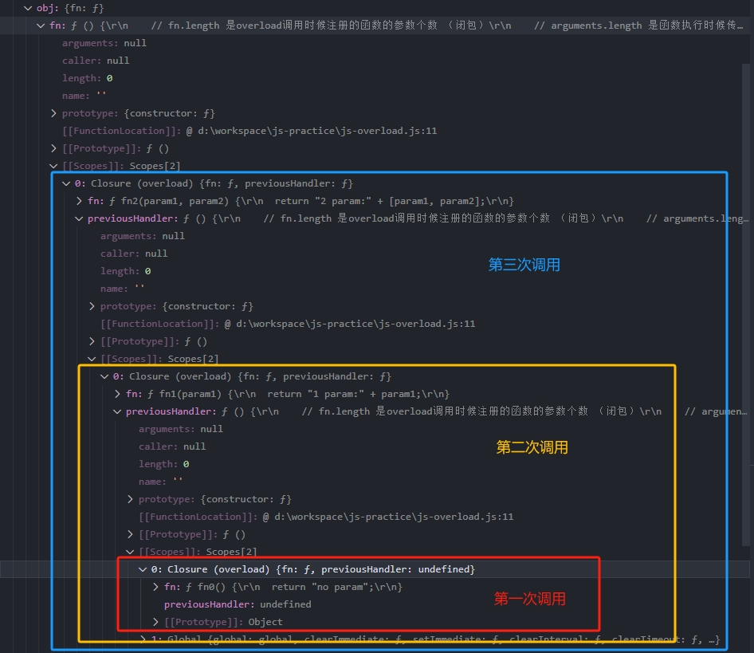

---  
date: 2024-03-05  
series: javascript  
tags:  
  - javascript  
  - 面试  
title: js-overload  
slug: js-overload  
keywords: javascript函数重载  
description: 面试,js函数重载,Jquery作者实现  
lastmod: 2024-03-07  
share: true  
---  
  
重载是面向对象编程语言（如JAVA、C#）里的特性，Javascript语言并不支持该特性。  
>重载（overload）是函数的名称一样，但是通过传入参数的个数不一样，调用不同的逻辑或返回不同的结果。  
  
#### 实现  
下面的方法是Jquery的作者John Resig实现的一个巧妙的思路：  
```javascript  
/**  
 * 函数重载方法  
 * @param {string} name  
 * @param {number} age  
 * @returns  
 */  
  
function overload(map, name, fn) {  
  const previousHandler = map[name]; // 保存之前的函数 闭包 可以查找之前的方法  
  map[name] = function () {  
    // fn.length 是overload调用时候注册的函数的参数个数 （闭包）  
    // arguments.length 是函数执行时候传入的参数个数  
    if (fn.length === arguments.length) {  
      return fn.apply(this, arguments);  
    } else if (typeof previousHandler === 'function') {  
      // 如果参数个数不匹配 则调用之前注册的方法  
      // 由于是闭包，所以可以查找之前的方法 一直递归调用 直到找到符合条件的方法  
      return previousHandler.apply(this, arguments);  
    }  
  }  
}  
  
const obj = {};  
  
// 不传参数时  
function fn0() {  
  return "no param";  
}  
  
// 传1个参数  
function fn1(param1) {  
  return "1 param:" + param1;  
}  
  
// 传两个参数时，返回param1和param2都匹配的name  
function fn2(param1, param2) {  
  return "2 param:" + [param1, param2];  
}  
  
overload(obj, "fn", fn0);//给obj添加第1个重载的函数  
  
overload(obj, "fn", fn1);//给obj添加第2个重载的函数  
  
overload(obj, "fn", fn2);//给obj添加第3个重载的函数  
  
console.log(obj.fn());//>> no param  
  
console.log(obj.fn(1));//>> 1 param:1  
  
console.log(obj.fn(1, 2));//>> 2 param:1,2  
```  
  
#### 解析  
主要是利用了闭包（[closure](./js-closure.md)）,每次调用`overload`方法，都会产生一个`previousHandler`方法，存储上一个方法，形成闭包，使之前的方法都存在与内存中。  
下面用一张图来清晰的展示：  
  
  
- `fn.length` 表示函数的形式参数的数量，`arguments`表示实际传入参数的数量  
- 判断实参和形参数量相同表示命中需要执行的函数直接执行  
- 如果没用命中则执行`previousHandler`，依次查找直到找到匹配函数后执行  
  
此时函数中的`this`是外层调用的对象`obj`。  
  
#### 总结  
虽然JavaScript上没有真正意义上的重载，但是却很常见，比如`splice`，一个参数是删除，两个参数是删除部分，三个参数是删除之后在新增。同样的还有`arseInt`等方法。  
重载的好处是，功能相近的函数可以通过一个函数来实现，减少函数定义的数量。