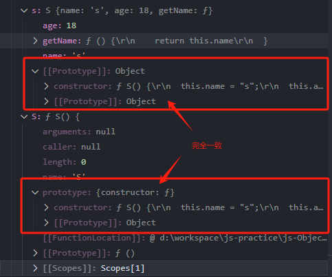
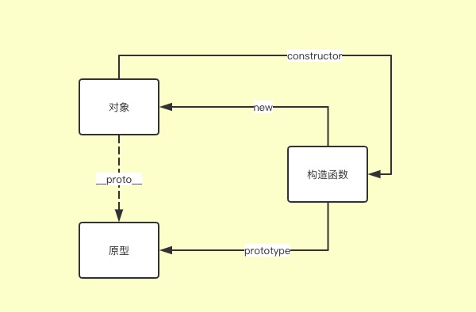
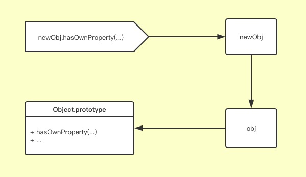

---  
date: 2024-03-08  
series: javascript  
tags:  
  - 面试  
  - javascript  
title: 原型、prototype、__proto__  
slug: js-prototype-intro  
keywords: javascript  
description: 面试，原型，prototype，继承，class，extends，原型链  
lastmod: 2024-03-08  
share: true  
---  
  
### 区分 prototype、\_\_proto\_\_、原型  
  
- **原型 ``[Prototype](Prototype.md)``**， 是对象的一个隐藏属性，它的值要是 `null` 要么是另一个*对象的引用*  
  
> 当我们在对象里查找属性时，如果没有找到则会自动从 `原型`（\[\[Prototype\]\]）里找 ,在编程中称之为“原型继承”  
  
- **`prototype` 是一个函数的属性，也是一个对象，它和原型没有绝对关系。**（函数也是一个对象，每个对象都有原型，但是函数有 `prototype` 属性，其他对象没有）  
  
```javascript  
var a = function(){};  
var b=[1,2,3];  
  
//函数才有prototype属性  
console.log(a.prototype);//>> function(){}  
//非函数，没有prototype属性  
console.log(b.prototype);//>> undefined  
```  
  
>`F.prototype` 属性仅在 `new F` 被调用时使用，它为新对象的 `[[Prototype]]` 赋值。  
>如果在创建之后，`F.prototype` 属性有了变化（`F.prototype = <another object>`），那么通过 `new F` 创建的新对象也将随之拥有新的对象作为 `[[Prototype]]`，但已经存在的对象将保持旧有的值。  
  
```javascript  
function Parent(name) {  
  this.name = name;  
}  
  
// 不建议直接修改prototype  
Parent.prototype = {  
  sayName: function () {  
    console.log(this.name + 'A')  
  }  
}  
  
const child1 = new Parent('child1')  
  
// 修改prototype  
Parent.prototype = {  
  sayName: function () {  
    console.log(this.name + 'B')  
  }  
}  
  
const child2 = new Parent('child2')  
  
// 第一次的值  
child1.sayName() // >> child1A  
// 返回修改后的值  
child2.sayName() // >> child2B  
```  
  
- **一个对象的 * 原型（\[\[Prototype\]\]）* 就是它构造函数的 `prototype` 属性的值**，**`__proto__` 也是原型的代名词**  
  
```javascript  
function S() {  
  this.name = "s";  
  this.age = 18;  
  this.getName = function () {  
    return this.name  
  }  
}  
const s = new S()  
console.log(s.__proto__ === S.prototype) // >> true  
```  
  
  
- 每个对象（实例）都有一个属性 \_\_proto\_\_，它指向构造函数（constructor）的 `prototype` 属性  
- 对象的 `__proto__` 也有自己的 `__proto__`，层层向上，直到 `__proto__` 为 null。这种由原型层层链接起来的数据结构成为 **原型链**。因为 null 不再有原型，所以原型链的末端是 null。  
  
```javascript  
var a = function(){};  
var b=[1,2,3];  
  
//a的构造函数是「Function函数」  
console.log(a.__proto__ == Function.prototype);//>> true  
//b的构造函数是「Array函数」  
console.log(b.__proto__ == Array.prototype);//>> true  
//因为「Function函数」和「Array函数」又都是对象，其构造函数  
//是「Object函数」，所以，a和b的原型的原型都是Object.prototype  
console.log(a.__proto__.__proto__ === Object.prototype);//>> true  
console.log(b.__proto__.__proto__ === Object.prototype);//>> true  
//Object作为顶级对象的构造函数，它实例的原型本身就不再有原型了，因此它原型  
//的__proto__属性为null  
console.log(new Object().__proto__.__proto__);//>> null  
//也即Object类型对象，其原型（Object.prototype）的__proto__为null  
console.log(Object.prototype.__proto__);//>> null  
```  
  
三者的关系如下图所示：  
  
  
>`__proto__` 是 `[[Prototype]]` 的因历史原因而留下来的 getter/setter  
>`__proto__` 属性有点过时了。现代编程语言建议我们应该使用函数 `Object.getPrototypeOf/Object.setPrototypeOf` 来取代 `__proto__` 去 get/set 原型  
  
### 原型的继承  
  
- 通过 `__proto__` 赋值，**EcmaScript6 规范，浏览器实现了它，但不推荐使用**  
  
```javascript  
const obj = {  
	methodA() {  
		console.log('obj method A')  
	}  
}  
const child = {}  
child.__proto__ = obj  
child.methodA() // >> obj method A  
```  
  
- `Object.getPrototypeOf`/`Reflect.getPrototypeOf` 和 `Object.setPrototypeOf`/`Reflect.setPrototypeOf`，**速度比较慢，不推荐使用**  
  
```javascript  
const obj = {  
	methodA() {  
		console.log('obj method A')  
	}  
}  
const child = {}  
Object.setPrototypeOf(child, obj)  
child.methodA() // >> obj method A  
```  
  
- `Object.create()`[语法](https://developer.mozilla.org/zh-CN/docs/Web/JavaScript/Reference/Global_Objects/Object/create)，以现有对象为原型，创建新的对象  
  
>语法  
Object.create(proto)  
Object.create(proto, propertiesObject)  
>返回值为指定原型对象和属性创建的新对象  
  
```javascript  
const person = {  
  isHuman: false,  
  printIntroduction: function () {  
    console.log(`My name is ${this.name}. Am I human? ${this.isHuman}`);  
  },  
};  
const me = Object.create(person);  
me.name = 'Matthew'; // "name" is a property set on "me", but not on "person"  
me.isHuman = true; // Inherited properties can be overwritten  
me.printIntroduction();  
// Expected output: "My name is Matthew. Am I human? true"  
```  
  
>修改已存在的对象的 `[[Prototype]]` 是很慢的一个操作  
>用 `Object.setPrototypeOf` 或 `obj.__proto__=`，" 即时 " 修改原型是一个非常缓慢的操作，因为它破坏了对象属性访问操作的内部优化。  
>而用 `Object.create()` 即在创建时就确定原型，故用其实现原型继承效率比较高  
  
### 原型链  
  
当访问某个对象的方法或属性时，如果该对象上没有，JS 引擎就会遍历原型链上每个原型对象，在这些原型对象里查找，直到找到为止，如果最终没找到则报错。  
  
```javascript  
var obj={  
    methodA(){  
        console.log("coffe");  
    }  
}  
var newObj = Object.create(obj);//以obj为原型创建一个新的对象  
newObj.hasOwnProperty("methodA");//>> false  
```  
  
`hasOwnProperty` 在 `newObj` 上没有定义，它的原型 `obj` 也没有，最终在原型链上 `Object.prototype` 找到。如下图所示：  
  
  
### class（类）的 prototype 和 \_\_proto\_\_  
  
关于 class（类）的使用见 [文档](https://developer.mozilla.org/zh-CN/docs/Web/JavaScript/Reference/Classes)  
- 类的本身指向构造函数  
  
```javascript  
class A {  
}  
  
A===A.prototype.constructor;//>> true  
```  
  
- **类的所有方法都定义在类的**`**prototype**`**属性上面**  
  
```javascript  
class A{  
  constructor() {  
    // ...  
  }  
  
  toString() {  
    // ...  
  }  
  
  toValue() {  
    // ...  
  }  
}  
  
// 等同于  
A.prototype = {  
  constructor() {},  
  toString() {},  
  toValue() {},  
};  
```  
  
>class 作为构造函数的语法糖，同时有 `prototype` 属性和 `__proto__` 属性，因此同时存在两条继承链  
>1. 子类的 `__proto__` 属性，表示构造函数的继承，总是指向父类  
>2. 子类 `prototype` 属性的 `__proto__` 属性，表示方法的继承，总是指向父类的 `prototype` 属性  
